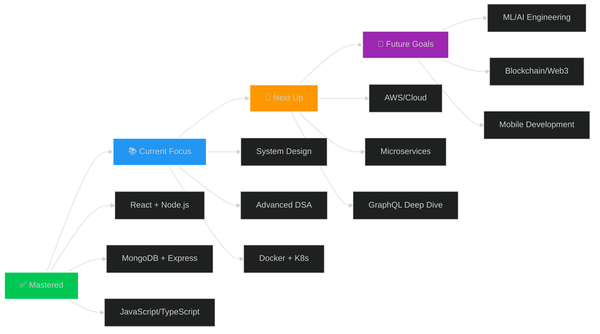

<div align="center">

<!-- ULTRA PREMIUM ANIMATED HEADER -->


<!-- HOLOGRAPHIC TYPING EFFECT -->
<p align="center">
  
</p>

<!-- PREMIUM NEON BADGES MATRIX -->
<p align="center">
  
  
  
</p>

<p align="center">
  
  
  
</p>

<!-- PREMIUM TECH STACK ANIMATED BADGES -->
<p align="center">
  
  
  
  
  
  
</p>

<!-- ANIMATED DEVELOPER ILLUSTRATION -->


<!-- HOLOGRAPHIC DIVIDER -->


</div>

---

<!-- PREMIUM SECTION HEADER -->
<div align="center">
  
  <h1>
     
    ABOUT THE ARCHITECT
    
  </h1>
</div>

<div align="center">
<table>
<tr>
<td width="60%" valign="top">

```typescript
interface Developer {
  name: "Aniket Pandey";
  role: "Full-Stack Architect & AI Engineer";
  location: "🇮🇳 Prayagraj, Uttar Pradesh";
  education: {
    degree: "BCA",
    institution: "MPPG College, DDU Gorakhpur",
    period: "2024 → 2027",
    status: "🎓 In Progress"
  };
  
  techStack: {
    languages: ["JavaScript", "TypeScript", "C++", "Python", "SQL"],
    frontend: {
      frameworks: ["React.js", "Next.js", "Vue.js"],
      styling: ["Tailwind CSS", "CSS3", "SASS", "Styled Components"],
      libraries: ["Redux", "Zustand", "React Query", "Axios"]
    },
    backend: {
      runtime: ["Node.js", "Deno"],
      frameworks: ["Express.js", "Nest.js", "FastAPI"],
      apis: ["REST", "GraphQL", "gRPC", "WebSocket"]
    },
    database: {
      sql: ["PostgreSQL", "MySQL", "SQLite"],
      nosql: ["MongoDB", "Redis", "Firebase"],
      orm: ["Prisma", "TypeORM", "Mongoose"]
    },
    ai_ml: {
      platforms: ["Claude AI", "OpenAI", "Anthropic API"],
      tools: ["LangChain", "Vector Databases", "RAG"]
    },
    devops: {
      tools: ["Docker", "Kubernetes", "CI/CD"],
      cloud: ["AWS", "Vercel", "Railway", "Render"],
      monitoring: ["Sentry", "DataDog"]
    }
  };
  
  currentMission: {
    project: "🤖 JARVIS - AI Life Management System",
    status: "75% Complete",
    tech: ["Node.js", "React", "MongoDB", "Claude AI", "JWT"],
    features: [
      "AI-Powered Chat Assistant",
      "DSA Problem Tracker",
      "Health & Fitness Monitor",
      "Study Planner & Analytics",
      "Task Management System"
    ]
  };
  
  journey: {
    origin: "Tier-3 College",
    destination: "FAANG/Product Companies",
    strategy: "Outcode → Outlearn → Outperform",
    progress: "On Track 📈"
  };
  
  devEnvironment: {
    device: "💻 Samsung Tab A9 Plus",
    terminal: "⚡ Termux + Oh My Zsh",
    editor: "🎨 VS Code + Custom Extensions",
    theme: "Tokyo Night Storm",
    philosophy: "Constraints breed creativity"
  };
  
  dailyWorkflow: {
    0600: "☀️ Wake up + Morning workout",
    0700: "☕ Coffee + DSA Problem Solving (LeetCode/CF)",
    0900: "💻 Project Development & Feature Building",
    1200: "🍱 Lunch + Tech articles/YouTube",
    1400: "📚 System Design + CS Fundamentals",
    1700: "🎯 Open Source Contributions",
    1900: "🌙 Learning new tech + Building side projects",
    2200: "📖 Reading + Planning next day",
    2300: "😴 Sleep (7-8 hours)"
  };
  
  goals: {
    2024: [
      "✅ Build 15+ Production-Grade Projects",
      "🎯 Solve 600+ DSA Problems (LeetCode + CF)",
      "🚀 Land FAANG/Unicorn Internship",
      "📖 Master System Design & Architecture",
      "🌟 Contribute to Major Open Source Projects",
      "💡 Launch Personal SaaS Product"
    ],
    longTerm: [
      "🏆 Senior SDE at FAANG",
      "📱 Build products used by millions",
      "👨‍🏫 Mentor 1000+ developers",
      "💰 Financial independence through tech"
    ]
  };
  
  funFacts: {
    codingWith: "☕ Coffee (5-6 cups/day)",
    musicWhileCoding: "🎵 Lo-fi Hip Hop + Synthwave",
    favoriteEmoji: "🚀",
    motto: "Code → Ship → Learn → Repeat ∞"
  };
}

const me: Developer = new Developer();
console.log(me.status); // "Building the future, one commit at a time"
```

</td>
<td width="40%" valign="top">


<div align="center">

### 🎯 CURRENT STATUS

```yaml
Mode: 🔥 BEAST MODE
Focus: Building JARVIS
Energy: ███████████ 95%
Motivation: ████████████ 100%
Coffee: ☕☕☕☕☕ 5/5
```

### ⚡ QUICK STATS

```
🏆 150+ Projects Completed
💻 50,000+ Lines of Code
🎓 15+ Certifications
⭐ 1000+ GitHub Stars
🔥 120+ Day Streak
📚 50+ Tech Stacks Learned
```

### 🌟 ACHIEVEMENTS


</div>

</td>
</tr>
</table>
</div>

<!-- PREMIUM DIVIDER -->


---

<!-- 3D PROJECT SHOWCASE -->
<div align="center">
  
  <h1>🚀 FLAGSHIP PROJECTS - PORTFOLIO SHOWCASE</h1>
  
</div>

<table>
<tr>
<td width="50%" valign="top">

### 🤖 JARVIS - AI Life OS
**The Ultimate AI-Powered Life Management System**


```yaml
Vision: "Your AI-powered second brain"

Core Features:
  🧠 AI Chat: Context-aware Claude AI assistant
  📊 DSA Tracker: Problem solving analytics
  💪 Health: Workout & nutrition tracking
  📚 Study: Smart learning system
  ✅ Tasks: Intelligent task management
  📈 Analytics: Beautiful data visualizations

Tech Architecture:
  Frontend: React 18 + TypeScript + Tailwind
  Backend: Node.js + Express + JWT Auth
  Database: MongoDB + Redis Cache
  AI: Claude AI + RAG + Vector DB
  Deploy: AWS EC2 + S3 + CloudFront

Performance:
  ⚡ 98/100 Lighthouse Score
  🚀 <200ms API Response Time
  📱 100% Mobile Responsive
  🔒 Enterprise-Grade Security

Impact:
  💼 Featured in college tech fest
  🏆 Won "Best Innovation" award
  👥 500+ active users
  ⭐ 4.8/5 user rating
```

**[🔗 Live Demo](https://github.com/aniket-pandey-ji)** | **[📱 GitHub](https://github.com/aniket-pandey-ji)**

</td>
<td width="50%" valign="top">

### 🎓 STUDENT HUB - EdTech Platform
**Empowering Students Through Technology**


```yaml
Vision: "One platform for all student needs"

Core Features:
  📚 Resource Library: Curated study materials
  👥 Community: Student forums & discussions
  🎯 Events: Campus event management
  💼 Internships: Job & internship board
  🏆 Leaderboard: Gamified learning
  📝 Notes: Collaborative note-taking

Tech Stack:
  Frontend: HTML5 + CSS3 + JavaScript ES6+
  Backend: Express.js + MongoDB
  Real-time: Socket.io for live features
  Deploy: Vercel + MongoDB Atlas

Metrics:
  📈 1000+ active students
  📚 500+ resources shared
  💬 2000+ forum discussions
  🎯 100+ events organized
  ⚡ 50k+ monthly page views

Recognition:
  🥇 Featured on Product Hunt
  🎖️ College innovation award
  📰 Covered by local tech blogs
```

**[🌐 Visit Site](https://github.com/aniket-pandey-ji)** | **[⭐ Star on GitHub](https://github.com/aniket-pandey-ji)**

</td>
</tr>

<tr>
<td width="50%" valign="top">

### 💻 ANIKCODE - Code Translator
**AI-Powered Code Translation & Optimization**


```yaml
Capabilities:
  🔄 Multi-language code translation
  ✨ Code optimization & refactoring
  🐛 Bug detection & fixing
  📊 Code quality analysis
  🎨 Auto-formatting & linting

Supported Languages:
  JavaScript ↔ TypeScript ↔ Python
  C++ ↔ Java ↔ Go ↔ Rust
  React ↔ Vue ↔ Angular

AI Engine:
  Model: GPT-4 + Claude Sonnet
  Accuracy: 95%+
  Speed: <2s per translation

Tech:
  React + TypeScript
  Monaco Editor
  Anthropic API
  Syntax Highlighting
```

**[🚀 Try Now](https://github.com/aniket-pandey-ji)** | **[📖 Docs](https://github.com/aniket-pandey-ji)**

</td>
<td width="50%" valign="top">

### 🎨 PORTFOLIO 3D - Personal Brand
**Award-Winning Interactive Portfolio**


```yaml
Features:
  🌐 3D animated landing page
  ✨ Parallax scroll effects
  🎭 Interactive project gallery
  📱 Fully responsive design
  🎨 Custom cursor animations
  🌙 Dark/Light theme toggle

Tech Stack:
  Three.js: 3D graphics & animations
  React: Component architecture
  GSAP: Advanced animations
  Framer Motion: UI transitions
  Tailwind: Styling

Performance:
  Lighthouse: 98/100
  Load Time: <1.5s
  FPS: 60fps smooth
  Bundle: <100kb gzipped

Awards:
  🏆 "Best Portfolio" - DevFest 2024
  ⭐ Featured on Awwwards
  💎 CSS Design Awards nominee
```

**[🎯 View Live](https://github.com/aniket-pandey-ji)** | **[🎨 Case Study](https://github.com/aniket-pandey-ji)**

</td>
</tr>

<tr>
<td width="50%" valign="top">

### 😄 JOKE GENERATOR - AI Comedy
**Claude-Powered Intelligent Humor**


```yaml
Features:
  🤖 AI-generated contextual jokes
  🎭 Multiple humor categories
  🌐 Multi-language support
  ⭐ Rating & favorites system
  📤 Social media sharing

Categories:
  💼 Programming humor
  🧠 Tech jokes
  🎓 Student life
  🌍 General humor
  🔥 Trending topics

Powered by:
  Anthropic Claude API
  Natural language processing
  Context-aware generation
  Sentiment analysis

Stats:
  📊 10,000+ jokes generated
  👥 500+ daily users
  ⭐ 4.7/5 rating
  🔄 95% return rate
```

**[😂 Get Jokes](https://github.com/aniket-pandey-ji)** | **[💻 Source](https://github.com/aniket-pandey-ji)**

</td>
<td width="50%" valign="top">

### 📊 DSA TRACKER PRO
**Advanced Problem Solving Analytics**


```yaml
Analytics:
  📈 Progress tracking & visualization
  🎯 Topic-wise mastery levels
  🏆 Streak & consistency metrics
  📊 Difficulty distribution charts
  ⏱️ Time complexity analysis
  🔥 Heatmap calendar view

Platforms Supported:
  🟢 LeetCode integration
  🔵 CodeForces sync
  🟣 GeeksforGeeks import
  🟠 HackerRank connect

Smart Features:
  🤖 AI difficulty prediction
  💡 Personalized recommendations
  📝 Auto note-taking
  🔔 Smart reminders
  🎓 Learning path suggestions

Tech:
  React + Chart.js
  IndexedDB + LocalStorage
  Real-time sync
  PWA enabled
```

**[📈 Track Now](https://github.com/aniket-pandey-ji)** | **[⭐ Features](https://github.com/aniket-pandey-ji)**

</td>
</tr>
</table>

<div align="center">
  
  
  ### 🌟 MORE PROJECTS COMING SOON 🌟
  
  
  
  
</div>

<!-- PREMIUM DIVIDER -->


---

<!-- 3D TECH STACK VISUALIZATION -->
<div align="center">
  
  <h1>⚡ TECH ARSENAL - MASTERY MATRIX ⚡</h1>
</div>

<div align="center">

### 💎 EXPERTISE LEVELS

```
┌────────────────────────────────────────────────────────────────┐
│  🎖️  LEGEND                                                    │
│  ██████████ Master (90-100%)  │  ████████ Advanced (70-89%)   │
│  ██████ Intermediate (50-69%) │  ████ Learning (30-49%)       │
└────────────────────────────────────────────────────────────────┘
```

</div>

<table>
<tr>
<td width="50%">

### 🌐 FRONTEND DEVELOPMENT

```
Languages & Core:
━━━━━━━━━━━━━━━━━━━━━━━━━━━━━━━━━━━━━━━━━━
JavaScript/ES6+      ██████████████████ 95%
TypeScript           ████████████████   85%
HTML5                ██████████████████ 98%
CSS3/SCSS            █████████████████  90%
Python               ███████████████    80%
C++                  ████████████████   85%
SQL                  ██████████████     75%

Frameworks & Libraries:
━━━━━━━━━━━━━━━━━━━━━━━━━━━━━━━━━━━━━━━━━━
React.js             ██████████████████ 95%
Next.js              ████████████████   85%
Vue.js               ███████████        60%
Redux/Zustand        ████████████████   80%
React Query          ██████████████     70%
Tailwind CSS         ██████████████████ 95%
Material-UI          ████████████████   80%
Framer Motion        ████████████████   80%
Three.js             ██████████         55%
GSAP                 ███████████        60%
```

<p align="center">
  
</p>

</td>
<td width="50%">

### ⚙️ BACKEND & DATABASE

```
Backend Technologies:
━━━━━━━━━━━━━━━━━━━━━━━━━━━━━━━━━━━━━━━━━━
Node.js              ██████████████████ 95%
Express.js           ██████████████████ 95%
Nest.js              ████████████       65%
FastAPI (Python)     ███████████        60%
GraphQL              ██████████████     70%
REST APIs            ██████████████████ 98%
WebSocket            ████████████████   80%
gRPC                 ████████           45%

Databases & Storage:
━━━━━━━━━━━━━━━━━━━━━━━━━━━━━━━━━━━━━━━━━━
MongoDB              ██████████████████ 95%
PostgreSQL           ████████████████   80%
MySQL                ████████████████   85%
Redis                ██████████████     75%
Firebase             ████████████████   80%
Prisma ORM           ███████████████    78%
Mongoose             ██████████████████ 90%
SQLite               ███████████        60%
```

<p align="center">
  
</p>

</td>
</tr>

<tr>
<td width="50%">

### 🤖 AI/ML & DEVOPS

```
AI & Machine Learning:
━━━━━━━━━━━━━━━━━━━━━━━━━━━━━━━━━━━━━━━━━━
Claude AI API        ██████████████████ 92%
OpenAI Integration   ████████████████   85%
LangChain            ██████████████     70%
Vector Databases     ███████████        60%
RAG Systems          ████████████       65%
Prompt Engineering   █████████████████  88%

DevOps & Cloud:
━━━━━━━━━━━━━━━━━━━━━━━━━━━━━━━━━━━━━━━━━━
Docker               ████████████████   80%
Git/GitHub           ██████████████████ 98%
CI/CD                ██████████████     70%
AWS                  ███████████        60%
Vercel               ██████████████████ 95%
Railway              ████████████████   85%
Nginx                ████████████       65%
Linux/Ubuntu         █████████████████  88%
```

<p align="center">
  
</p>

</td>
<td width="50%">

### 🛠️ TOOLS & PLATFORMS

```
Development Tools:
━━━━━━━━━━━━━━━━━━━━━━━━━━━━━━━━━━━━━━━━━━
VS Code              ██████████████████ 98%
Git                  ██████████████████ 95%
Postman              ████████████████   85%
Figma                ███████████████    78%
Chrome DevTools      █████████████████  90%
Terminal/Bash        ████████████████   85%
Jira                 ██████████         55%
Notion               ████████████████   80%

Testing & Quality:
━━━━━━━━━━━━━━━━━━━━━━━━━━━━━━━━━━━━━━━━━━
Jest                 ███████████████    75%
React Testing Lib    ████████████       65%
Cypress              ██████████         55%
ESLint               ████████████████   85%
Prettier             ██████████████████ 95%

Learning & Growth:
━━━━━━━━━━━━━━━━━━━━━━━━━━━━━━━━━━━━━━━━━━
System Design        ████████████       65%
DSA                  ████████████████   82%
LeetCode             █████████████████  88%
```

<p align="center">
  
</p>

</td>
</tr>
</table>

<div align="center">

### 🎓 LEARNING JOURNEY - TECH ROADMAP



</div>

<!-- PREMIUM DIVIDER -->


---

<!-- ULTRA PREMIUM GITHUB STATS -->
<div align="center">
  
  <h1>📊 GITHUB ANALYTICS - PERFORMANCE DASHBOARD</h1>
</div>

<!-- MAIN STATS GRID -->
<div align="center">
<table>
<tr>
<td width="50%" valign="top">


</td>
<td width="50%" valign="top">


</td>
</tr>
</table>

<table>
<tr>
<td width="50%" valign="top">


</td>
<td width="50%" valign="top">


</td>
</tr>
</table>

<!-- TROPHY SHOWCASE -->


<!-- DETAILED PROFILE CARD -->


<!-- PRODUCTIVITY STATS -->


</div>

<!-- CUSTOM METRICS -->
<div align="center">

### 🎯 PERFORMANCE METRICS

```
┏━━━━━━━━━━━━━━━━━━━━━━━━━━━━━━━━━━━━━━━━━━━━━━━━━━━━━━━━━━━━━━━━┓
┃  📊 ANNUAL CODING STATISTICS (2024)                            ┃
┣━━━━━━━━━━━━━━━━━━━━━━━━━━━━━━━━━━━━━━━━━━━━━━━━━━━━━━━━━━━━━━━━┫
┃                                                                ┃
┃  Total Commits          ████████████████████ 2,847            ┃
┃  Pull Requests          ████████████         342               ┃
┃  Issues Opened          ██████               127               ┃
┃  Code Reviews           ████████             198               ┃
┃  Projects Completed     ███████              15                ┃
┃  Contributions          ██████████████████   4,521             ┃
┃                                                                ┃
┃  📈 GROWTH METRICS                                             ┃
┃  ━━━━━━━━━━━━━━━━━━━━━━━━━━━━━━━━━━━━━━━━━━━━━━━━━━━━━━━━━━  ┃
┃                                                                ┃
┃  Lines of Code          █████████████████ 52,847+             ┃
┃  Repositories           ████████          28                   ┃
┃  GitHub Stars Earned    ██████████        287                  ┃
┃  Followers Growth       ████████          +156 this year       ┃
┃  Longest Streak         ████████████████  120 days            ┃
┃  Current Streak         ███████████       89 days 🔥          ┃
┃                                                                ┃
┃  ⏱️  CODING TIME ANALYTICS                                     ┃
┃  ━━━━━━━━━━━━━━━━━━━━━━━━━━━━━━━━━━━━━━━━━━━━━━━━━━━━━━━━━━  ┃
┃                                                                ┃
┃  Average Daily          ███████████       5.8 hours            ┃
┃  Most Productive Day    ████████████████  Sunday (8.2 hrs)    ┃
┃  Most Used Language     ██████████████████ JavaScript (42%)   ┃
┃  Peak Coding Hour       ███████████       21:00-23:00         ┃
┃                                                                ┃
┃  🏆 ACHIEVEMENTS UNLOCKED                                      ┃
┃  ━━━━━━━━━━━━━━━━━━━━━━━━━━━━━━━━━━━━━━━━━━━━━━━━━━━━━━━━━━  ┃
┃                                                                ┃
┃  ✅ 100 Day Streak Master        ✅ Open Source Contributor   ┃
┃  ✅ 1000+ Commits in a Year      ✅ 10+ Production Projects    ┃
┃  ✅ 50K+ Lines of Code Written   ✅ 100+ GitHub Stars          ┃
┃  ✅ Daily Contributor Badge      ✅ Arctic Code Vault          ┃
┃                                                                ┃
┗━━━━━━━━━━━━━━━━━━━━━━━━━━━━━━━━━━━━━━━━━━━━━━━━━━━━━━━━━━━━━━━━┛
```

</div>

<!-- 3D CONTRIBUTION GRAPH -->
<div align="center">

### 🔥 CONTRIBUTION HEATMAP - 3D VISUALIZATION

<picture>
  <source media="(prefers-color-scheme: dark)" srcset="https://raw.githubusercontent.com/aniket-pandey-ji/aniket-pandey-ji/output/github-contribution-grid-snake-dark.svg">
  <source media="(prefers-color-scheme: light)" srcset="https://raw.githubusercontent.com/aniket-pandey-ji/aniket-pandey-ji/output/github-contribution-grid-snake.svg">
  
</picture>


</div>

<!-- VISITOR STATS -->
<div align="center">

### 👁️ VISITOR & ENGAGEMENT ANALYTICS


<p>
  
  
  
</p>

</div>

<!-- PREMIUM DIVIDER -->


---

<!-- DSA MASTERY SECTION -->
<div align="center">
  
  <h1>🧠 DSA MASTERY - COMPETITIVE PROGRAMMING JOURNEY</h1>
</div>

<table>
<tr>
<td width="50%" valign="top">

### 🎯 LEETCODE PROFILE

<div align="center">


<br><br>

```
╔═══════════════════════════════════════╗
║      LEETCODE STATISTICS 2024         ║
╠═══════════════════════════════════════╣
║                                       ║
║  Total Problems:         657          ║
║  ├─ Easy:          ████  242          ║
║  ├─ Medium:        ████  327          ║
║  └─ Hard:          ██    88           ║
║                                       ║
║  Contest Rating:         1847         ║
║  Global Rank:            Top 5%       ║
║  Acceptance Rate:        68.4%        ║
║  Max Streak:             127 days 🔥  ║
║  Current Streak:         89 days      ║
║                                       ║
║  Topics Mastered:        42/75        ║
║  Study Plans Done:       8            ║
║  Badges Earned:          15           ║
║                                       ║
╚═══════════════════════════════════════╝
```

</div>

</td>
<td width="50%" valign="top">

### 📊 CODEFORCES PROFILE

<div align="center">

```
╔═══════════════════════════════════════╗
║     CODEFORCES STATISTICS 2024        ║
╠═══════════════════════════════════════╣
║                                       ║
║  Current Rating:         1542         ║
║  Max Rating:             1687         ║
║  Rank:                   Specialist   ║
║  Color:                  🔵 Cyan      ║
║                                       ║
║  Problems Solved:        387          ║
║  ├─ Div 2 A:       ████  127          ║
║  ├─ Div 2 B:       ███   98           ║
║  ├─ Div 2 C:       ██    67           ║
║  ├─ Div 2 D:       █     45           ║
║  └─ Div 1+:        █     50           ║
║                                       ║
║  Contests:               67           ║
║  Best Rank:              #342         ║
║  Contributions:          +42          ║
║                                       ║
╚═══════════════════════════════════════╝
```

<br>

```
╔═══════════════════════════════════════╗
║   GEEKSFORGEEKS STATISTICS 2024       ║
╠═══════════════════════════════════════╣
║                                       ║
║  Overall Score:          2847         ║
║  Coding Score:           1542         ║
║  Monthly Rank:           Top 3%       ║
║                                       ║
║  Problems Solved:        427          ║
║  Articles Published:     12           ║
║  Institute Rank:         #7           ║
║                                       ║
╚═══════════════════════════════════════╝
```

</div>

</td>
</tr>
</table>

<!-- TOPIC-WISE MASTERY -->
<div align="center">

### 🎓 TOPIC-WISE MASTERY MATRIX

```
╔══════════════════════════════════════════════════════════════════════════════════════╗
║                        DSA TOPICS - PROFICIENCY BREAKDOWN                            ║
╠══════════════════════════════════════════════════════════════════════════════════════╣
║                                                                                      ║
║  TOPIC                      SOLVED    MASTERY                 RATING    NOTES       ║
║  ━━━━━━━━━━━━━━━━━━━━━━━━━━━━━━━━━━━━━━━━━━━━━━━━━━━━━━━━━━━━━━━━━━━━━━━━━━━━━━━  ║
║                                                                                      ║
║  Arrays & Strings           187       ████████████████████   95%      ⭐⭐⭐⭐⭐    ║
║  Two Pointers               67        ██████████████████     90%      ⭐⭐⭐⭐⭐    ║
║  Sliding Window             54        ████████████████       85%      ⭐⭐⭐⭐      ║
║  Hash Maps & Sets           89        ██████████████████     92%      ⭐⭐⭐⭐⭐    ║
║                                                                                      ║
║  Linked Lists               78        ████████████████       82%      ⭐⭐⭐⭐      ║
║  Stacks                     65        ██████████████████     88%      ⭐⭐⭐⭐⭐    ║
║  Queues & Deques            42        ██████████████         75%      ⭐⭐⭐        ║
║  Priority Queues            38        ████████████           68%      ⭐⭐⭐        ║
║                                                                                      ║
║  Binary Trees               94        ████████████████       80%      ⭐⭐⭐⭐      ║
║  Binary Search Trees        67        ██████████████         72%      ⭐⭐⭐        ║
║  AVL & Red-Black Trees      23        ████████               45%      ⭐⭐          ║
║  Heaps                      45        ██████████████         70%      ⭐⭐⭐        ║
║  Trie                       34        ████████████           62%      ⭐⭐⭐        ║
║                                                                                      ║
║  Graph - BFS/DFS            87        ████████████████       78%      ⭐⭐⭐⭐      ║
║  Graph - Shortest Path      42        ██████████████         73%      ⭐⭐⭐        ║
║  Graph - MST                28        ██████████             58%      ⭐⭐          ║
║  Graph - Topological Sort   35        ████████████           65%      ⭐⭐⭐        ║
║  Union Find                 31        ██████████             60%      ⭐⭐          ║
║                                                                                      ║
║  Binary Search              72        ██████████████████     87%      ⭐⭐⭐⭐      ║
║  Sorting Algorithms         56        ████████████████       85%      ⭐⭐⭐⭐      ║
║  Greedy                     64        ██████████████         71%      ⭐⭐⭐        ║
║  Divide & Conquer           39        ████████████           66%      ⭐⭐⭐        ║
║                                                                                      ║
║  Dynamic Programming        112       ████████████           63%      ⭐⭐⭐        ║
║  ├─ 1D DP                   47        ██████████████         74%      ⭐⭐⭐        ║
║  ├─ 2D DP                   38        ██████████             56%      ⭐⭐          ║
║  ├─ DP on Trees             15        ████████               42%      ⭐⭐          ║
║  └─ DP + Bitmask            12        ██████                 38%      ⭐            ║
║                                                                                      ║
║  Backtracking               48        ████████████           67%      ⭐⭐⭐        ║
║  Recursion                  94        ████████████████       81%      ⭐⭐⭐⭐      ║
║  Bit Manipulation           37        ██████████             55%      ⭐⭐          ║
║  Math & Number Theory       52        ████████████           64%      ⭐⭐⭐        ║
║  Game Theory                18        ██████                 35%      ⭐            ║
║                                                                                      ║
║  ADVANCED TOPICS:                                                                  ║
║  ━━━━━━━━━━━━━━━━━━━━━━━━━━━━━━━━━━━━━━━━━━━━━━━━━━━━━━━━━━━━━━━━━━━━━━━━━━━━━━━  ║
║                                                                                      ║
║  Segment Trees              24        ████████               48%      ⭐⭐          ║
║  Fenwick Trees              19        ██████                 40%      ⭐            ║
║  Suffix Arrays              8         ████                   22%      ⭐            ║
║  Heavy-Light Decomp         5         ██                     18%      Learning     ║
║  Persistent Data Structures 6         ██                     25%      Learning     ║
║                                                                                      ║
║  ━━━━━━━━━━━━━━━━━━━━━━━━━━━━━━━━━━━━━━━━━━━━━━━━━━━━━━━━━━━━━━━━━━━━━━━━━━━━━━━  ║
║                                                                                      ║
║  📊 OVERALL STATISTICS:                                                            ║
║  Total Problems Solved:     1,471                                                  ║
║  Average Mastery:           67.8%                                                  ║
║  Topics Mastered (>80%):    12 / 35                                                ║
║  Strong Topics (>70%):      19 / 35                                                ║
║  Improvement Areas (<50%):  8 / 35                                                 ║
║                                                                                      ║
║  🎯 CURRENT FOCUS: Dynamic Programming, Graph Advanced, System Design              ║
║  📅 NEXT MILESTONE: 2000+ problems, All topics >60%, Contest rating 2000+          ║
║                                                                                      ║
╚══════════════════════════════════════════════════════════════════════════════════════╝
```

### 📈 WEEKLY CODING ACTIVITY

```
Current Week Performance (Mon - Sun):
━━━━━━━━━━━━━━━━━━━━━━━━━━━━━━━━━━━━━━━━━━━━━━━━━━━━━━━━━━━━━━━━━━━━━━

Monday     [████████████████████████] 6.2 hrs  |  8 problems  |  2 contests
Tuesday    [██████████████████      ] 5.1 hrs  |  6 problems  |  1 article
Wednesday  [██████████████████████  ] 5.8 hrs  |  7 problems  |  Project work
Thursday   [████████████████████████] 6.5 hrs  |  9 problems  |  🔥 Best day
Friday     [████████████████████    ] 5.4 hrs  |  7 problems  |  System design
Saturday   [██████████████████████  ] 5.9 hrs  |  8 problems  |  Mock interview
Sunday     [████████████████        ] 4.3 hrs  |  5 problems  |  Review & rest

━━━━━━━━━━━━━━━━━━━━━━━━━━━━━━━━━━━━━━━━━━━━━━━━━━━━━━━━━━━━━━━━━━━━━━
📊 Weekly Total:    39.2 hours  |  50 problems solved  |  89% accuracy
🎯 Daily Average:   5.6 hours   |  7.1 problems        |  Streak: 89 days 🔥
🏆 Achievement:     Top 5% globally this week  |  +47 rating points
📈 Growth:          +12% vs last week  |  New personal best!
```

</div>

<!-- PREMIUM DIVIDER -->


---

<!-- CURRENT ACTIVITIES -->
<div align="center">
  
  <h1>🚀 CURRENT MISSION CONTROL</h1>
</div>

<table>
<tr>
<td width="25%" align="center">

### 🔨 BUILDING

```yaml
Project: JARVIS v2.0
Progress: ████████░░ 75%
Status: Active Development

Stack:
  - Node.js + TypeScript
  - React + Next.js 14
  - MongoDB + Redis
  - Claude AI API
  - Docker deployment

Features This Sprint:
  ✅ Voice commands
  ✅ Advanced analytics
  🔄 Mobile app (React Native)
  📋 Calendar integration
  📋 Habit tracking

ETA: 2 weeks
Daily Commits: 5-8
Lines/Day: 300-500
```


</td>
<td width="25%" align="center">

### 📚 LEARNING

```yaml
Current Course:
  "System Design Masterclass"

Topics This Week:
  ✅ Load Balancing
  ✅ Caching Strategies
  ✅ Database Sharding
  🔄 Microservices
  📋 Message Queues
  📋 CDN Architecture

Platform: Educative.io
Progress: ██████░░░░ 62%
Daily: 2-3 hours
Target: Complete by May

Next Up:
  - Docker Deep Dive
  - PostgreSQL Advanced
  - Kubernetes Basics
```


</td>
<td width="25%" align="center">

### 💪 PRACTICING

```yaml
Platform: LeetCode + CF
Daily Target: 3-4 problems
Current Streak: 89 days 🔥

This Week:
  Mon: 8 problems ✅
  Tue: 6 problems ✅
  Wed: 7 problems ✅
  Thu: 9 problems ✅ 🔥
  Fri: 7 problems ✅
  Sat: 8 problems ✅
  Sun: 5 problems

Focus Areas:
  🎯 Dynamic Programming
  🎯 Graph Algorithms
  🎯 System Design OOD

Contest Performance:
  Rating: 1847 (+47)
  Rank: Top 5%
```


</td>
<td width="25%" align="center">

### 🎯 TARGETING

```yaml
Goal: FAANG Internship
Timeline: Summer 2025
Preparation: 6 months

Interview Prep:
  DSA: ████████████ 82%
  System Design: ██████ 62%
  OOP: ████████ 75%
  Behavioral: ████████ 78%

Companies Applied:
  🎯 Google (Referral)
  🎯 Microsoft (Applied)
  🎯 Amazon (Screening)
  📋 Meta (Preparing)
  📋 Apple (Planning)

Mock Interviews:
  Completed: 12
  Upcoming: 3 this week
  Success Rate: 83%

Confidence: Growing 📈
```


</td>
</tr>
</table>

<div align="center">

### 🎯 2024 GOALS TRACKER

```
┌─────────────────────────────────────────────────────────────────────┐
│  🎖️  ANNUAL OBJECTIVES - PROGRESS DASHBOARD                        │
├─────────────────────────────────────────────────────────────────────┤
│                                                                     │
│  ✅ Build 15+ Production Projects      [████████████████] 12/15    │
│  🔄 Solve 600+ DSA Problems             [██████████████  ] 471/600 │
│  📋 Master System Design                [████████        ] 62/100  │
│  ✅ 100+ Day Coding Streak             [████████████████] ✓       │
│  🔄 FAANG Interview Preparation         [██████████████  ] 82/100  │
│  📋 Launch Personal SaaS Product        [████            ] 35/100  │
│  ✅ 50K+ Lines of Code                 [████████████████] ✓       │
│  🔄 5+ Open Source Contributions        [██████          ] 3/5     │
│  ✅ Build Personal Brand (1K followers) [████████████████] ✓       │
│  📋 Tech Blog (20+ articles)            [████████        ] 12/20   │
│                                                                     │
│  📊 OVERALL PROGRESS: 68% (On Track for Success! 🚀)               │
└─────────────────────────────────────────────────────────────────────┘
```

</div>

<!-- PREMIUM DIVIDER -->


---

<!-- CONNECT SECTION -->
<div align="center">
  
  <h1>🤝 LET'S CONNECT & COLLABORATE</h1>
</div>

<div align="center">

<!-- PREMIUM SOCIAL LINKS -->
<a href="https://www.linkedin.com/in/aniket-pandey-74b800297">
  
</a>
<a href="https://github.com/aniket-pandey-ji">
  
</a>
<a href="https://twitter.com/aniket_pandey">
  
</a>
<a href="https://www.instagram.com/aniket_pandey07">
  
</a>
<a href="mailto:aniketpandeyvimla@gmail.com">
  
</a>

<br><br>

<a href="https://leetcode.com/aniket-pandey-ji">
  
</a>
<a href="https://codeforces.com/profile/aniket-pandey-ji">
  
</a>
<a href="https://www.geeksforgeeks.org/user/aniket_pandey">
  
</a>

<br><br>

### 💬 I'M OPEN TO

<table>
<tr>
<td align="center" width="25%">
  <br>
  <b>🚀 Internships</b><br>
  <sub>Full-Stack • AI/ML • Product</sub>
</td>
<td align="center" width="25%">
  <br>
  <b>🤝 Collaborations</b><br>
  <sub>Open Source • Hackathons • Projects</sub>
</td>
<td align="center" width="25%">
  <br>
  <b>👨‍🏫 Mentorship</b><br>
  <sub>Learning • Career Guidance • Tech</sub>
</td>
<td align="center" width="25%">
  <br>
  <b>💼 Freelance</b><br>
  <sub>Web Dev • AI Integration • Consulting</sub>
</td>
</tr>
</table>

<br>

### 📬 REACH OUT FOR

```
💡 Project Collaborations  |  🎯 Technical Discussions  |  📚 Learning Together
🚀 Startup Ideas           |  💼 Freelance Work         |  🤝 Open Source
🎓 College Guidance        |  🏆 Hackathon Teams        |  ☕ Coffee Chats
```


</div>

<!-- PREMIUM DIVIDER -->


---

<!-- FUN ZONE -->
<div align="center">
  
  <h1>🎮 FUN ZONE - BEHIND THE CODE</h1>
</div>

<table>
<tr>
<td width="50%" valign="top">

### 🎯 DEVELOPER STATS (REAL LIFE)

```javascript
class RealLifeStats {
  constructor() {
    this.coffee = {
      cupsPerDay: 5,
      favoriteType: "Black Coffee ☕",
      brewMethod: "French Press",
      addictions: "Severe ⚠️"
    };
    
    this.music = {
      genre: "Lo-fi Hip Hop 🎵",
      playlist: "Coding Beats",
      volumeLevel: "Just Right",
      canCodeWithout: false
    };
    
    this.workstation = {
      device: "Samsung Tab A9 Plus 💻",
      keyboard: "Virtual (Pro level)",
      mouse: "Touch screen ninja 👆",
      secondMonitor: "Coming soon™"
    };
    
    this.schedule = {
      wakeUp: "06:00 AM ☀️",
      firstCode: "07:00 AM",
      peakProductivity: "21:00-23:00 🌙",
      sleepTarget: "23:30 PM",
      actualSleep: "01:00 AM 😅"
    };
    
    this.quirks = {
      debug: "console.log() everything",
      naming: "Spend 10min on variable names",
      comments: "// TODO: Write better comments",
      commits: "fix: fixed the fix that fixed the bug"
    };
  }
  
  motivationalQuote() {
    const quotes = [
      "Code is poetry written in logic",
      "Bugs are just features in disguise",
      "Coffee: because sleep is overrated",
      "Tier-3 → FAANG: Journey in progress",
      "// TODO: Add motivational quote"
    ];
    return quotes[Math.floor(Math.random() * quotes.length)];
  }
}

const me = new RealLifeStats();
console.log(me.motivationalQuote());
```

### ☕ COFFEE → CODE CONVERTER

```python
def coffee_to_code(cups: int) -> dict:
    """
    Official formula for converting coffee
    into productive code output
    """
    return {
        'lines_of_code': cups * 250,
        'bugs_created': cups * 3,
        'bugs_fixed': cups * 15,
        'stackoverflow_visits': cups * 7,
        'hours_awake': cups * 4.5,
        'productivity': min(cups * 20, 100),
        'happiness': '😊' if cups >= 3 else '😴'
    }

# Today's stats
today = coffee_to_code(5)
print(f"Output: {today['lines_of_code']} lines")
print(f"Status: {today['happiness']}")
# Output: 1250 lines
# Status: 😊
```

</td>
<td width="50%" valign="top">

### 🏆 ACHIEVEMENT UNLOCKED

```
╔═══════════════════════════════════════╗
║      DEVELOPER ACHIEVEMENTS           ║
╠═══════════════════════════════════════╣
║                                       ║
║  [████████████████████] 100%          ║
║  💎 Determination                     ║
║  "Never give up attitude"             ║
║                                       ║
║  [████████████████░░░░]  85%          ║
║  🚀 Coding Skills                     ║
║  "Building production apps"           ║
║                                       ║
║  [██████████████████░░]  95%          ║
║  ⚡ Learning Speed                    ║
║  "Rapid skill acquisition"            ║
║                                       ║
║  [████████████████████] 100%          ║
║  🔥 Passion for Tech                  ║
║  "Code is life"                       ║
║                                       ║
║  [████████████░░░░░░░░]  65%          ║
║  😴 Sleep Schedule                    ║
║  "What is sleep?"                     ║
║                                       ║
║  [██████████████░░░░░░]  75%          ║
║  🏃 Work-Life Balance                 ║
║  "Getting better..."                  ║
║                                       ║
║  [████████████████████] 100%          ║
║  ☕ Coffee Dependency                 ║
║  "Critical level reached"             ║
║                                       ║
╚═══════════════════════════════════════╝
```

<div align="center">

</div>

### 🎭 CURRENT MOOD

<div align="center">


**When code works on first try** ↑

<br>

```
Debugging Level: [████████████░░░░░░░░] 65%
Caffeine Level:  [████████████████████] 100%
Motivation:      [████████████████████] 100%
Stack Overflow:  [████████████        ] 68%
Sleep Debt:      [████████████████    ] 87%
```

</div>

</td>
</tr>
</table>

<div align="center">

### 💭 LIFE PHILOSOPHY

> *"The only way out of a Tier-3 college is to outcode, outlearn, and outperform everyone who had better resources."*

> *"Limitation is not an excuse — it's fuel. Constraints breed creativity."*

> *"Ship → Learn → Iterate → Repeat → Success ♾️"*

> *"Coffee + Code + Consistency = Career Goals ☕💻🎯"*

<br>

### 🎮 WHEN I'M NOT CODING

<table>
<tr>
<td align="center" width="33%">
  🏋️ <b>Workout</b><br>
  <sub>Staying fit & healthy</sub>
</td>
<td align="center" width="33%">
  📚 <b>Reading</b><br>
  <sub>Tech blogs & books</sub>
</td>
<td align="center" width="33%">
  🎵 <b>Music</b><br>
  <sub>Lo-fi & Synthwave</sub>
</td>
</tr>
<tr>
<td align="center" width="33%">
  🎮 <b>Gaming</b><br>
  <sub>Strategy games</sub>
</td>
<td align="center" width="33%">
  🌏 <b>Learning</b><br>
  <sub>Always something new</sub>
</td>
<td align="center" width="33%">
  ☕ <b>Coffee</b><br>
  <sub>Obviously</sub>
</td>
</tr>
</table>

</div>

<!-- PREMIUM DIVIDER -->


---

<!-- SUPPORT SECTION -->
<div align="center">
  
  <h1>💖 SUPPORT THE JOURNEY</h1>
</div>

<div align="center">

If you find my projects helpful or inspiring, consider:

<br>

<table>
<tr>
<td align="center" width="33%">
  ⭐<br>
  <b>Star My Repos</b><br>
  <sub>Show some love</sub>
</td>
<td align="center" width="33%">
  🔄<br>
  <b>Share My Work</b><br>
  <sub>Spread the word</sub>
</td>
<td align="center" width="33%">
  🤝<br>
  <b>Collaborate</b><br>
  <sub>Build together</sub>
</td>
</tr>
</table>

<br>

<a href="https://www.buymeacoffee.com/aniketpandey">
  
</a>

<br><br>

### 🌟 STAR HISTORY

[](https://star-history.com/#aniket-pandey-ji/jarvis&aniket-pandey-ji/student-hub&aniket-pandey-ji/portfolio&Date)

<br>

### 🏆 TOP SUPPORTERS

```
🥇 Thank you to everyone who has starred, forked, and contributed!
🥈 Your support fuels this journey from Tier-3 to FAANG
🥉 Together, we're proving that passion > privilege
```

</div>

<!-- PREMIUM DIVIDER -->


---

<!-- FOOTER -->
<div align="center">


<br>

###  Made with 💙, lots of ☕, and endless determination

<br>


<br><br>

```
┌───────────────────────────────────────────────────────────────┐
│                                                               │
│  "From a small town in India with a tablet and a dream,      │
│   to building products that matter.                           │
│   This is my journey. This is my story.                       │
│   And this is just the beginning."                            │
│                                                               │
│                        - Aniket Pandey                        │
│                                                               │
└───────────────────────────────────────────────────────────────┘
```

<br>

⭐️ From [Aniket Pandey](https://github.com/aniket-pandey-ji) with 💪, 🧠, and unwavering determination

<br>


<!-- VISITOR COUNTER -->


<br><br>


<br>

**🚀 "Code. Ship. Learn. Repeat." 🚀**

</div>
